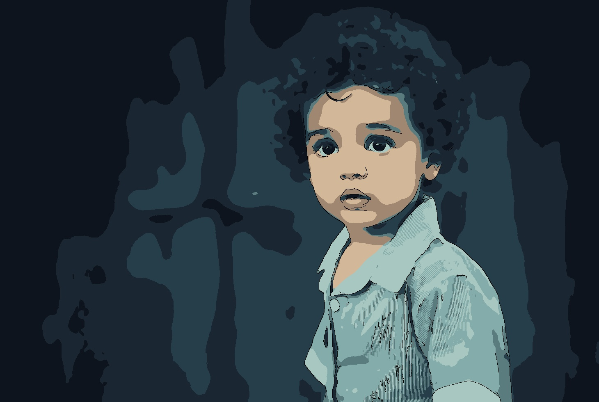

# 🎨 Fawanees: Efficient Cartoonization Tool

A powerful, lightweight Python tool to convert images and videos into beautiful cartoon styles using an optimized computer vision pipeline. No heavy deep learning models required by default—just fast, deterministic, and highly customizable image processing.

---

### 🖼️ Visual Demo

<table>
  <tr>
    <td align="center"><b>Original Input</b><br><br></td>
    <td align="center"><b>Cartoonized Output</b><br><br></td>
  </tr>
</table>

---

### ⚙️ How the Pipeline Works

The core engine processes every image or video frame through a highly optimized, 5-stage computer vision pipeline:

1. **Colour Smoothing**  
   Applies advanced filtering (e.g., Bilateral filter) to reduce noise and blend similar colors while strictly preserving hard edges. This stage can operate in standard BGR or perceptually uniform LAB color space for better results.
2. **Colour Quantisation**  
   Reduces the continuous color spectrum into a discrete, flat palette (using K-Means clustering). This creates the classic "posterized" or painted look of traditional cell-shaded animation.
3. **Edge Detection**  
   Extracts the structural outlines of the scene to simulate hand-drawn ink lines. Supports both standard Canny edge detection and Adaptive thresholding for varied artistic styles.
4. **Deep Learning Hook *(Optional)***  
   A built-in architectural extension point designed to seamlessly inject neural networks (like CartoonGAN) between quantization and compositing for hybrid AI-traditional effects. *(Currently a no-op in the base implementation, ready for subclassing).*
5. **Compositing**  
   Intelligently blends the quantized color base with the extracted edge map, applying final adjustments (like edge dilation) to produce the polished, final cartoon frame.

---

### ✨ Key Features

- **Dual Interface**: Use via a fast Command-Line Interface (CLI) or a modern, interactive Streamlit Web UI.
- **Artistic Presets**: Instantly switch between `default`, `sketch`, `watercolor`, `comic`, or `fast` configurations.
- **Fine-Grained Control**: Override edge detection thresholds, blur kernels, color spaces, and palette size (`K`).
- **Video Support**: Process entire video clips with optional frame limiting for rapid prototyping.
- **Debug & Benchmarking**: Generate visual grids of intermediate pipeline stages and print per-stage execution timings.

---

### 🚀 Quick Start

#### 1. Installation
```bash
# Clone the repository and navigate to the folder
git clone https://github.com/yourusername/cartoonizer.git
cd cartoonizer

# Create and activate a virtual environment (recommended)
python -m venv venv
source venv/bin/activate  # On Windows: venv\Scripts\activate

# Install dependencies
pip install -r requirements.txt